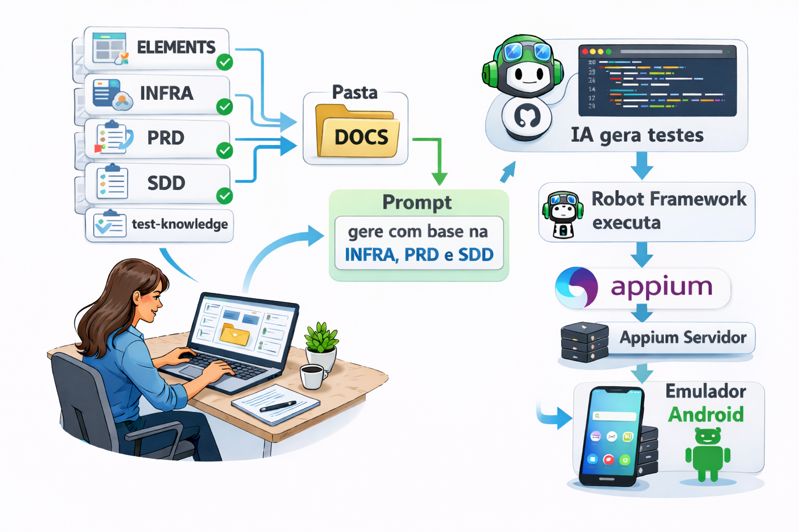

# doc-driven-mobile-automation

**Automação Mobile Guiada por Documentação (PRD → SDD → Elements)**

Projeto de automação de testes para aplicativo Android de Relógio usando **Robot Framework + Appium**.

## 📋 Sobre o Projeto

POC que implementa testes automatizados para criação de alarmes no app de Relógio Android com validação de período AM/PM em formato de 12 horas.

**Diferencial**: Projeto **guiado por documentação completa** (PRD + SDD + Elements) que serve como modelo de desenvolvimento estruturado para automação de testes mobile.

**Metodologia**: BDD (Gherkin) + Page Object Model + Keyword Layering

**Stack**: Robot Framework 7.0.1 | Appium 2.x | Python 3.8+ | UiAutomator2

## 🔄 Processo de Desenvolvimento Guiado por Documentação

Este projeto segue uma metodologia **documentation-driven** onde a documentação orienta toda a implementação dos testes:

### Fluxo de Trabalho

```
1. PRD (O QUE testar) → 2. Elements (ONDE testar) → 3. SDD (COMO implementar) → 4. Testes Robot
```

### 1️⃣ **PRD (Product Requirements Document)**
Define **o que** deve ser testado:
- Requisitos funcionais e não-funcionais
- Casos de teste em formato Gherkin (Given-When-Then)
- Critérios de aceitação
- Cenários de sucesso e falha

**Exemplo prático**: O PRD especifica que devemos criar alarmes AM e PM, validar formato de 12 horas e confirmar que o alarme é salvo na lista.

### 2️⃣ **Elements (UI Element Mapping)**
Mapeia **onde** os testes vão interagir:
- Todos os localizadores (XPath, ID, Accessibility ID)
- Estratégias de localização priorizadas
- Elementos reutilizáveis entre testes
- Fallbacks para maior robustez

**Exemplo prático**: Define que o botão "+" é `resource-id=fab`, o campo de hora é `//android.widget.RadialTimePickerView`, etc.

### 3️⃣ **SDD (Software Design Document)** ⭐
Determina **como** implementar os testes:
- Arquitetura técnica (Page Object Model + Keyword Layering)
- Stack de ferramentas (Robot Framework, Appium, UiAutomator2)
- Estrutura de pastas e organização de código
- Padrões de implementação e boas práticas
- Configurações de ambiente e capabilities

**Exemplo prático**: O SDD define que:
- `alarm_page.robot` contém apenas localizadores (camada UI)
- `alarm_keywords.robot` contém a lógica de negócio (camada de abstração)
- `test_alarm.robot` contém casos de teste em Gherkin (camada de teste)
- Timeouts implícitos de 20s, validações robustas com Wait Until

### 4️⃣ **Implementação dos Testes**
Com base nos documentos anteriores:
- **PRD** → casos de teste (`test_alarm.robot`)
- **Elements** → page objects (`alarm_page.robot`)
- **SDD** → keywords e arquitetura (`alarm_keywords.robot`)

### ✅ Vantagens dessa Abordagem

| Benefício | Descrição |
|-----------|-----------|
| 🎯 **Clareza** | Toda equipe entende O QUE, ONDE e COMO testar |
| 🔄 **Manutenibilidade** | Mudanças na UI afetam apenas Elements; mudanças de lógica apenas Keywords |
| 📚 **Onboarding** | Novos membros entendem o projeto pela documentação |
| 🤖 **IA-Friendly** | Estrutura perfeita para uso com IA/Copilot na criação de testes |
| ✅ **Rastreabilidade** | Requisitos PRD → Elementos → Código implementado |

## 🎬 Demonstração

### Vídeo da Automação em Ação


### Modelo de Arquitetura


## 🏗️ Estrutura

```
POC-IA-ROBOT/
├── tests/test_alarm.robot           # Casos de teste BDD
├── resources/
│   ├── keywords/alarm_keywords.robot # Keywords de negócio
│   └── pages/alarm_page.robot        # Locators (Page Objects)
├── docs/alarm-project/               # Documentação completa
│   ├── prd/PRD.md
│   ├── ssd/SDD.md
│   └── elements/Elements.md
└── requirements.txt
```

## 🚀 Quick Start

### Pré-requisitos

- **Node.js** 14+ com Appium 2.x instalado globalmente
- **Python** 3.8+ com ambiente virtual
- **Android SDK** com ADB no PATH
- **Dispositivo Android** (físico/emulador) API 28+ em formato de 12 horas

### Instalação

```bash
# 1. Clonar e navegar
git clone <url-do-repositorio>
cd POC-IA-ROBOT

# 2. Criar ambiente virtual Python
python -m venv .venv
source .venv/Scripts/activate  # Windows Git Bash
# .venv\Scripts\activate.bat   # Windows CMD

# 3. Instalar dependências
pip install -r requirements.txt
cd appium && npm install && cd ..

# 4. Configurar dispositivo
adb devices  # Verificar conexão
adb shell settings put system time_12_24 12  # Formato 12h
```

### Executar Testes

```bash
# 1. Iniciar Appium (terminal separado)
appium

# 2. Executar testes (outro terminal, com venv ativo)
robot tests/test_alarm.robot

# 3. Ver resultados
start report.html  # Windows
```

**Comandos adicionais**:
```bash
robot --include am tests/test_alarm.robot      # Apenas teste AM
robot --include pm tests/test_alarm.robot      # Apenas teste PM
robot --loglevel DEBUG tests/test_alarm.robot  # Log detalhado
```

## ⚠️ Troubleshooting

| Problema | Solução |
|----------|---------|
| **Element not found** | `adb shell settings put system time_12_24 12` |
| **Connection refused** | Iniciar Appium: `appium` |
| **No devices** | `adb devices` e aceitar USB debugging no dispositivo |
| **App não abre** | Validação robusta já implementada com 3 fallbacks |
| **Timeout** | Timeouts já configurados em 20s |

**Diagnóstico avançado**:
```bash
adb shell pm list packages | grep clock
adb shell am start -n com.google.android.deskclock/com.android.deskclock.DeskClock
appium driver list
```

## 📚 Documentação

Documentação completa em [`docs/alarm-project/`](docs/alarm-project/):

- **[PRD.md](docs/alarm-project/prd/PRD.md)** - Requisitos e casos de teste
- **[SDD.md](docs/alarm-project/ssd/SDD.md)** - Design técnico e arquitetura
- **[Elements.md](docs/alarm-project/elements/Elements.md)** - Mapeamento de elementos UI
- **[Test-Rules.md](docs/alarm-project/test-knowledge/Test-Rules.md)** - Regras e convenções

## 🛠️ Comandos Úteis

```bash
# Appium
appium --log-level debug

# ADB
adb devices
adb shell settings get system time_12_24
adb logcat

# Robot Framework
robot --include smoke tests/
robot --outputdir results tests/
```

**Versão**: 1.0.0 | **Robot Framework**: 7.0.1 | **Appium**: 2.x

## 📱 Configuração do Dispositivo de Teste

**Emulador Android Virtual Device (AVD):**
- **Nome AVD**: Pixel_5
- **Modelo**: sdk_gphone64_x86_64
- **Android**: 12 (API Level 31)
- **Arquitetura**: x86_64
- **Densidade**: 440 dpi
- **Formato de hora**: 12 horas (AM/PM)

**Para replicar o ambiente:**
1. Android Studio → Device Manager → Create Virtual Device
2. Selecionar: Pixel 5
3. System Image: Android 12.0 (API 31) x86_64
4. Configurar formato 12h: `adb shell settings put system time_12_24 12`


## 📄 Licença

Projeto de demonstração e fins educacionais.

---
